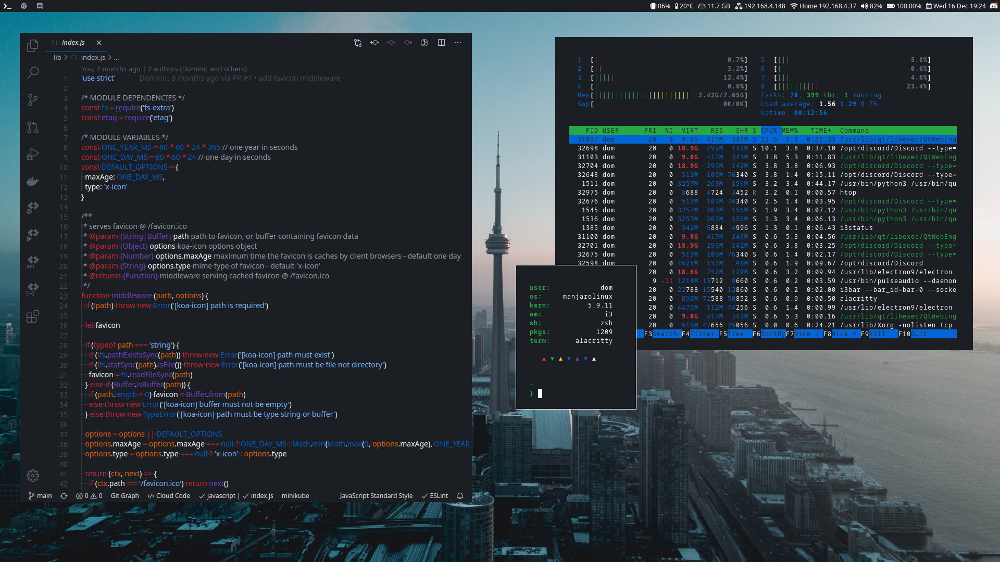

<h1 align='center'>Dom's dotfiles</h1>

<h4 align='center'>There's no place like ~</h4>

  
  
    
  
    

Dotfiles are the files used to store user-specific application configuration. This repository contains my personal ever evolving dotfiles that are used to configure software across both the **Linux** and **MacOS** platforms. I'm mainly a **Linux** guy but feel comfortable switching it up when when the situation calls for it. This repository allows me to easily store, manage and access my dotfiles, even when faced with a fresh environment I am able to be set up in minutes making me feel at `~` once again. My dotfiles are managed with [GNU Stow](https://www.gnu.org/software/stow/), a *free* and *open source* symlink farm manager. I am working on a setup script capable of auto installing all dotfiles with stow based upon system platform.

<h6 align='center'>Please read and understand all configuration files you use before installing on your system<h6>

## Bugs

I want my dotfiles to work for everyone; that means when you clone and install them they should just work. That said, I use this repository for my personal evolving dotfiles, so there's a good chance I may break something. If you run into any problems or bug when installing or using these dotfiles please feel free to open a [GitHub Issue](https://github.com/dominicegginton/dotfiles/issues/new) on this repository and I'd love to get it fixed for you.